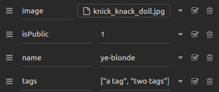
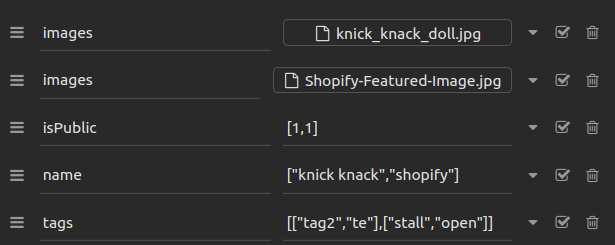
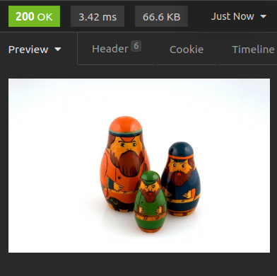

# Fungible Fair

A website to store Non-Fungible Tokens (NFT's) in a not so fungible way.

The easiest way to interface with the backend is through an API client like [Insomnia](https://insomnia.rest/) or [Postman](https://www.postman.com/). The client will deal with all authentication tokens. An insommnia project has been included for convenience.

## Table of Contents

[Quickstart](#quickstart-guide)
[API Documentation](#api-documentation)

- [File Types Supported](#file-types-supported)
- [User Routes](#user-routes)
- [Profile Routes](#profile-routes)
- [Image Routes](#image-routes)
- [Image Routes (hosted links)](#image-routes-hosted-links)
- [Image Routes (download)](#image-routes-download)
- [Tag Routes](#tag-routes)

## Quickstart Guide

1. Clone the repository

## API Documentation

### File Types Supported

Most [common image file types](https://developer.mozilla.org/en-US/docs/Web/Media/Formats/Image_types) are supported

- .apng
- .avif
- .gif
- .jpg / .jpeg
- .png
- .svg
- .webp

### User Routes

The following three routes deal with authentication. Sessions are kept through a JWT that the server sends to the client through the `Set-Cookie` field. For all routes except for the user routes, an accompanying JWT will be rquired to access the endpoints.

`POST /user`

Creates a user.

##### URL Example

`http://localhost:3000/user`

##### Body Example

```json
{
  "name": "john dee",
  "email": "sample@shopify.com",
  "password": "password123"
}
```

##### Response Example

```json
{
  "info": {
    "changes": 1,
    "lastInsertRowid": 1
  }
}
```

This is an example of a 200 response. Error states will show the error instead of the object shown above.

<hr />

`POST /user/login`

Login for a user. Returns a JWT through the Set-Cookie field

##### URL Example

`http://localhost:3000/user/login`

##### Body Example

```json
{
  "email": "sample@shopify.com",
  "password": "password123"
}
```

##### Response Example

```
"Successful Login"
```

<hr />

`DELETE /user/logout`

Logout for a user. Deletes the JWT stored on the browser.

##### URL Example

`http://localhost:3000/user/logout`

##### Body Example

```
N/A
```

##### Response Example

```
"Logged out successfully"
```

<hr />

### Profile Routes

`GET /profile`

Gets profile information about the current user supplied through the JWT.

##### URL Example

`http://localhost:3000/profile`

##### Body Example

```
N/A
```

##### Response Example

```json
{
  "name": "john dee",
  "email": "sample@shopify.com",
  "numImages": 0
}
```

<hr />

### Image Routes

`POST /image`

Uploads an image.

##### URL Example

`http://localhost:3000/image`

##### Body Example

Multipart Form

```json
{
  "image": { FILE_OBJECT },
  "isPublic": 1,
  "name": "image name",
  "tags": ["tag one", "second tag"]
}
```



##### Response Example

```json
"File uploaded!"
```

<hr />

`POST /image/bulk`

Bulk upload for images

##### URL Example

`http://localhost:3000/image/bulk`

##### Body Example

Multipart Form

```json
{
  "image": { FILE_OBJECT },
  "image": { FILE_OBJECT2 },
  "image": { FILE_OBJECT3 },
  "isPublic": [1, 2, 3],
  "name": ["cool picture", "cooler picture", "coolest picture"],
  "tags": [["tag one", "second tag"], [], ["dog tag"]]
}
```



The length of the fields: `isPublic`, `name`, and `tags` all need to be equal to the number of images that are being uploaded.

##### Response Example

```json
"Files uploaded successfully"
```

<hr />

`DELETE /image/id/:imageID`

Deletes an image by its image ID

##### URL Example

`http://localhost:3000/image/id/2`

##### Body Example

```
N/A
```

##### Response Example

```json
"Deleted image"
```

<hr />

### Image Routes (hosted links)

These endpoints would be used to disaply the images on the front end. Each endpoint will return a link at `/imageLink/{image.jpg}` along with the name of the image and the permission.

`GET /image/link/name/:imageName`

Get all of the current user's images with a specific name.

##### URL Example

`http://localhost:3000/image/link/name/yeezus`

##### Body Example

```
N/A
```

##### Response Example

```json
{
  "images": [
    {
      "id": 9,
      "image": "http://localhost:3000/imageLink/9f27330d-62c0-49bb-803a-26f3bf79e392.png",
      "name": "yeezus",
      "isPublic": 1
    },
    {
      "id": 10,
      "image": "http://localhost:3000/imageLink/afb65662-af80-4049-8a39-cbfeb4791ef6.png",
      "name": "yeezus",
      "isPublic": 1
    },
    {
      "id": 11,
      "image": "http://localhost:3000/imageLink/6beb0b32-0db5-417a-9071-8bf2c6605afe.gif",
      "name": "yeezus",
      "isPublic": 1
    }
  ]
}
```

<hr />

`GET /image/link/tag/:tagName`

Get all of the current user's images containing a tag that matches `tagName`.

##### URL Example

`http://localhost:3000/image/link/tag/logo`

##### Body Example

```
N/A
```

##### Response Example

```json
{
  "images": [
    {
      "id": 4,
      "image": "http://localhost:3000/imageLink/53fb40a0-4b69-4ec0-882e-f38124923dde.jpg",
      "name": "shop",
      "isPublic": 1
    },
    {
      "id": 6,
      "image": "http://localhost:3000/imageLink/31d24804-cc74-455a-81e5-0d068ab80b57.jpg",
      "name": "shopify",
      "isPublic": 1
    }
  ]
}
```

<hr />

`GET /image/link/all`

Get all of the current user's images.

##### URL Example

`http://localhost:3000/image/link/all`

##### Body Example

```
N/A
```

##### Response Example

```json
{
  "images": [
    {
      "image": "http://localhost:3000/imageLink/506cad84-e2f5-43fe-ad92-74baba40d2ad.jpg",
      "name": "knick knack",
      "isPublic": 1
    },
    {
      "image": "http://localhost:3000/imageLink/01176148-a17b-4710-8b6d-048ece61435d.jpg",
      "name": "shopify",
      "isPublic": 1
    },
    {
      "image": "http://localhost:3000/imageLink/4d94b3f5-e39c-4570-8179-5634ccf5a2d2.jpg",
      "name": "shop",
      "isPublic": 1
    }
  ]
}
```

<hr />

`GET /image/link/public`

Get all public images regardless of ownership.

##### URL Example

`http://localhost:3000/image/link/public`

##### Body Example

```
N/A
```

##### Response Example

```json
{
  "images": [
    {
      "id": 1,
      "image": "http://localhost:3000/imageLink/506cad84-e2f5-43fe-ad92-74baba40d2ad.jpg",
      "name": "knick knack",
      "isPublic": 1
    },
    {
      "id": 2,
      "image": "http://localhost:3000/imageLink/01176148-a17b-4710-8b6d-048ece61435d.jpg",
      "name": "shopify",
      "isPublic": 1
    },
    {
      "id": 3,
      "image": "http://localhost:3000/imageLink/4d94b3f5-e39c-4570-8179-5634ccf5a2d2.jpg",
      "name": "shop",
      "isPublic": 1
    }
    {
      "id": 7,
      "image": "http://localhost:3000/imageLink/a20c96e4-f466-4e83-88d2-5a3c8b105c6b.jpg",
      "name": "shop",
      "isPublic": 1
    }
  ]
}
```

<hr />

### Image Routes (download)

These endpoints would be used if a user wants to download one or many images. Each endpoint will return either the image file or a zip folder depending on how many images you’re requesting.

`GET /image/name/:imageName`

Get all of the current user's images with a specific name.

##### URL Example

`http://localhost:3000/image/name/nesting-dolls`

##### Body Example

```
N/A
```

##### Response Example



If three were multiple images with the name `nesting-dolls`, you would receive a zip file of both of them.

<hr />

`GET /image/tag/:tagName`

Get all of the current user's images containing a tag that matches `tagName`.

##### URL Example

`http://localhost:3000/image/tag/logo`

<hr />

`GET /image/all`

Get all of the current user's images.

##### URL Example

`http://localhost:3000/image/all`

<hr />

`GET /image/public`

Get all public images regardless of ownership.

##### URL Example

`http://localhost:3000/image/public`

<hr />

### Tag Routes

`GET /tag/imageID/:imageID`

Returns all tags on the imageID.

##### URL Example

`http://localhost:3000/tag/imageID/4`

##### Body Example

```
N/A
```

##### Response Example

```json
[
  {
    "tagID": 1,
    "tagName": "newTag",
    "imageID": 4
  },
  {
    "tagID": 2,
    "tagName": "logo",
    "imageID": 4
  }
]
```

<hr />

`PUT /tag`

Updates tagName for a given tagID.

##### URL Example

`http://localhost:3000/tag`

##### Body Example

```json
{
  "tagID": 1,
  "tagName": "newTagBody"
}
```

##### Response Example

```json
"Added/Updated tags"
```

<hr />
